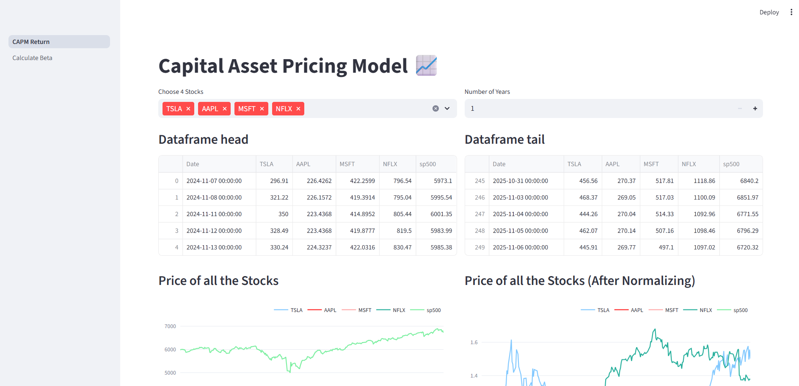
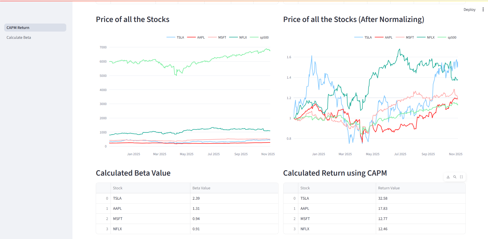
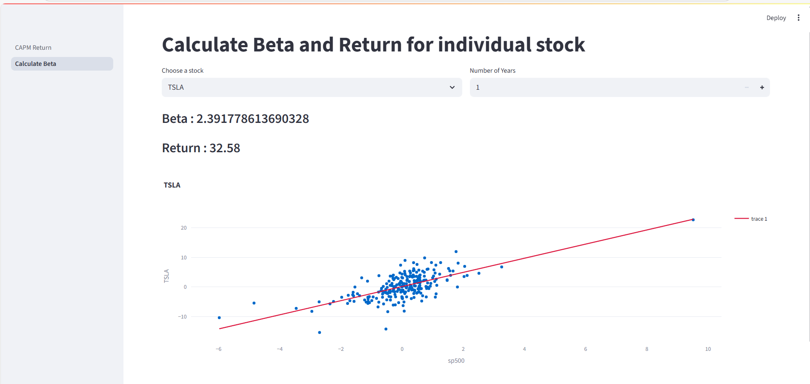

# 📈 Capital Asset Pricing Model (CAPM) Web App

An interactive **Streamlit web application** that analyzes the relationship between individual stock returns and market performance using the **Capital Asset Pricing Model (CAPM)**.  
It calculates **Beta** and **Expected Return** to evaluate stock risk and potential return compared to the market benchmark (S&P 500).

---

## 🧠 Overview

This project helps investors and analysts estimate how a stock reacts to market movements.  
Using **historical price data**, it computes:
- **Beta** (stock volatility relative to the market)
- **Expected Return** (based on the CAPM formula)

The app includes two modules:
1. **CAPM Return** → Compare multiple stocks together  
2. **Calculate Beta** → Analyze an individual stock in detail  

---

## 🖼️ Screenshots

| CAPM Return | Calculate Beta | Results Page |
|--------------|----------------|---------------|
|  |  |  |

*(Store all screenshots in the `/images` folder and name them as shown above.)*

---

## 🎯 Business Problem

To identify how much risk and expected return a particular stock carries compared to the overall market index, helping investors make data-driven portfolio decisions.

---

## 📊 Dataset

- **Stock Data:** Downloaded from [Yahoo Finance](https://finance.yahoo.com/) using the `yfinance` API.  
- **Market Index:** S&P 500 data fetched from [FRED (Federal Reserve)](https://fred.stlouisfed.org/) using `pandas_datareader`.  
- **Data Type:** Daily closing prices for selected stocks and market index.  

---

## 🧰 Tools & Technologies

| Category | Tools/Packages |
|-----------|----------------|
| Language | Python |
| Dashboard | Streamlit |
| Data Handling | Pandas, NumPy |
| Data Retrieval | yfinance, pandas_datareader |
| Visualization | Plotly Express |
| Utility Scripts | capm_functions.py |

---

## 🗂️ Project Structure

```
CAPM/
│
├── CAPM_Return.py # Streamlit app for multi-stock analysis
├── calculate_beta.py # Streamlit app for single-stock beta and return
├── capm_functions.py # Utility functions for data processing and calculations
├── images/ # Contains app screenshots
├── requirements.txt # Project dependencies
└── README.md # Project documentation
```


---

## 🧹 Data Cleaning & Preparation

- Download stock and market (S&P 500) data for selected years.
- Align datasets by **date** and remove missing values.
- Compute **daily returns** for both market and stock data.
- Normalize stock prices for uniform visualization.

---

## 🔍 Core Calculations

1. **Daily Return:**  
   \[
   \text{Return} = \frac{(P_t - P_{t-1})}{P_{t-1}} \times 100
   \]

2. **Beta (β) and Alpha (α):**  
   Using linear regression:  
   \[
   R_i = α + βR_m
   \]
   where  
   - \( R_i \): Stock return  
   - \( R_m \): Market return

3. **Expected Return (CAPM):**  
   \[
   E(R_i) = R_f + β_i (R_m - R_f)
   \]
   - \( R_f \): Risk-free rate (assumed 0)  
   - \( R_m \): Market return (S&P 500)  

---

## 📈 Exploratory Dashboard

### 🔹 **CAPM Return Page**
- Select multiple stocks and time period.
- View:
  - Head and tail of price data
  - Interactive price charts (original & normalized)
  - Beta values and CAPM-based return for each stock

### 🔹 **Calculate Beta Page**
- Analyze an individual stock.
- Compute and visualize:
  - **Beta**
  - **Expected Return**
  - **Scatter Plot** with regression line (Stock vs Market)

---

## 🧾 Sample Output

| Stock | Beta | Return (%) |
|--------|-------|------------|
| TSLA | 2.39 | 32.58 |
| AAPL | 1.31 | 17.83 |
| MSFT | 0.94 | 12.77 |
| NFLX | 0.91 | 12.46 |

---

## 🚀 How to Run the App

1. Clone this repository:
   ```bash
   git clone https://github.com/<your-username>/CAPM-Streamlit-App.git
   cd CAPM-Streamlit-App
